## Moncierge - Tracking your budget, simplified. 

### Moncierge is a mobile application to manage the time-defined budgets for personal use, group or have supervised budgets.  

### 📌 Table of Contents
* [Summary](#summary)
* [Requirements](#requirements)
* [Tech Stack](#tech-stack)
* [Design and Architecture](#design-and-architecture)
* [Snippets](#snippets)
* [Instructions to Run](#instructions-to-run)
* [Future Scope](#future-scope)
* [References](#references)

### 📝 Summary
- Moncierge helps users track their expenses and manage their budget effectively.
- Users can define different categories and set a budget for each category. The application provides notifications if there is a violation in the budget.
- The application can be used for personal savings goals or for shared responsibilities, such as a shared budget for a flat or an organization's inventory, a trip, for organizers of a college fest or for child's allowance monitoring etc.
- Users can assign a supervisor to monitor their spending habits.

### 📋 Requirements
- Create and login account
- Users can elect a mode - personal or shared
- Create a group (under shared mode)
- Within each mode:
    - Define a category
    - Set a budget per category and/or overall for a given period (if needed)
    - Notification when expense exceeds the budget
    - Add/assign a supervisor for a given budget
    - Users can add an expense under a defined a category
    - Reporting:
        - Monthly reporting for expenditures and savings - overall summary along with per category distribution
        - Custom reports - Users can select a date range and/or choose a category to get a statement of the expenses
    - Specific for shared budget:
        - Add/invite members to join the group.
        - (Optional) Assign per user budget in the group along with per category.

### 💻 Tech Stack

### 📐 Design and Architecture
Describes the high level design 

#### Class Diagram
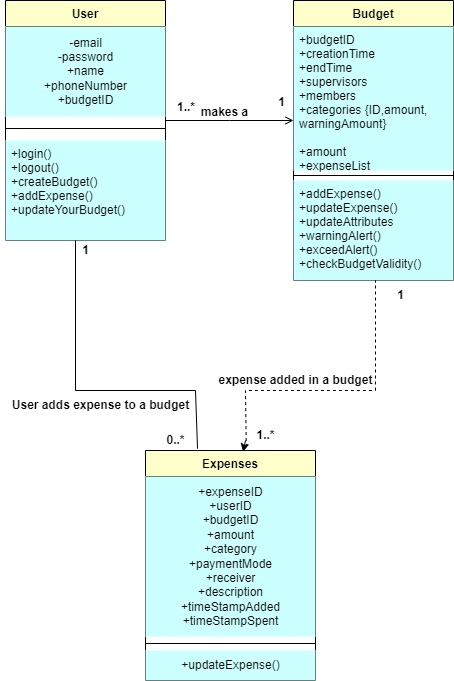

#### NoSQL Database Diagram
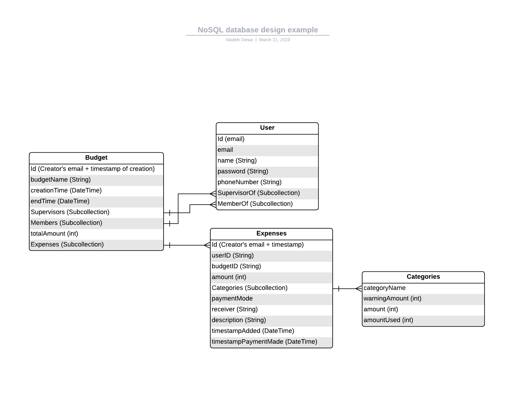

#### Workflow Diagram
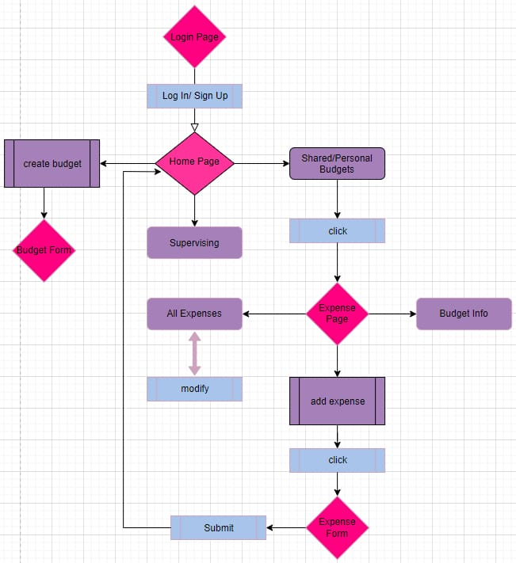

#### Notification Workflow
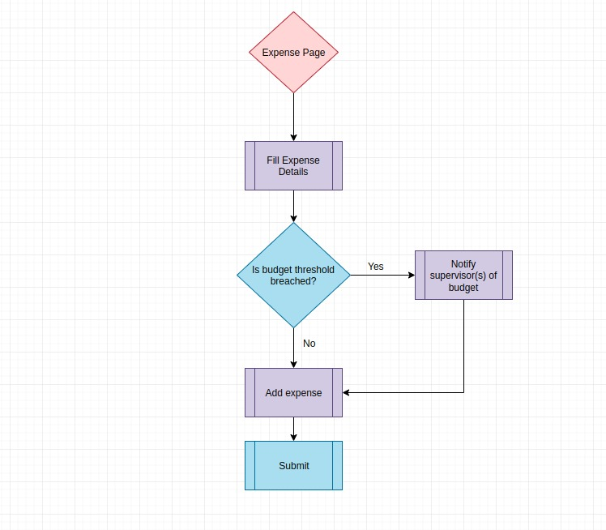

### 💡 Snippets
Some working snippets of the project (UI or API or command line)
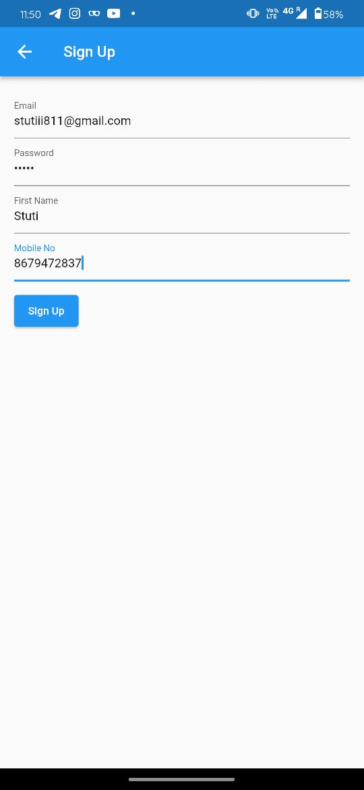
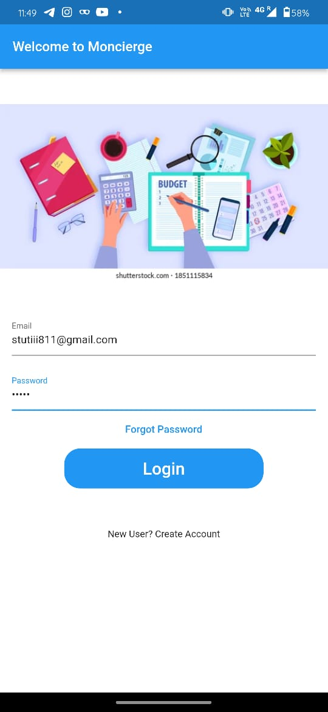
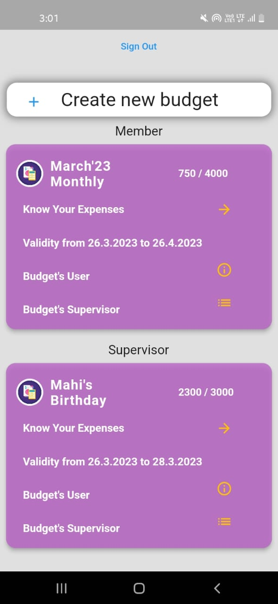
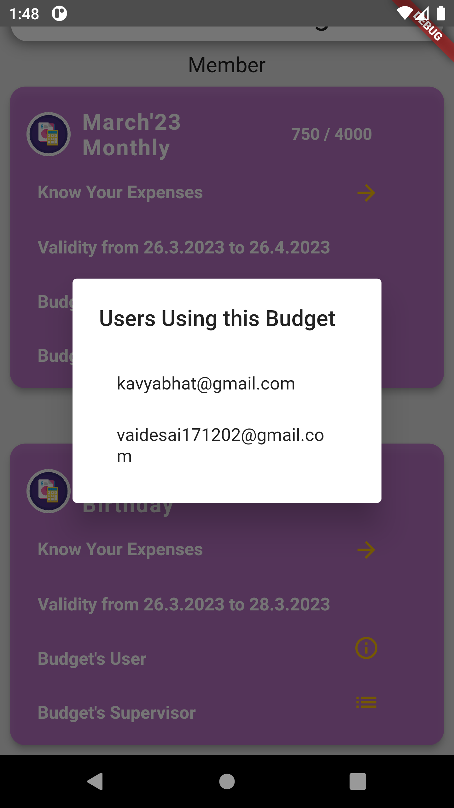
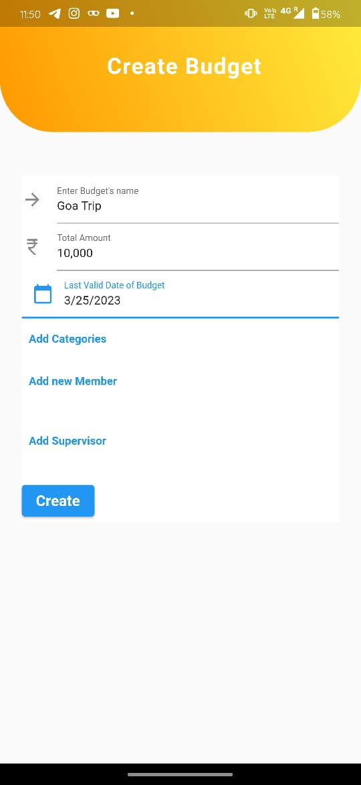
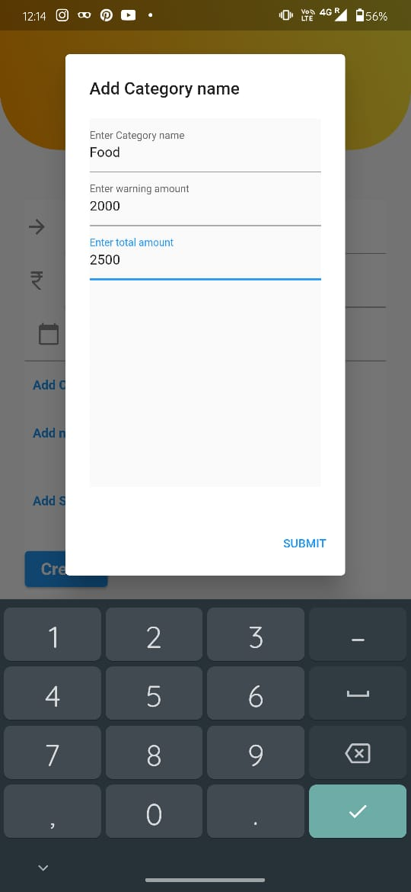
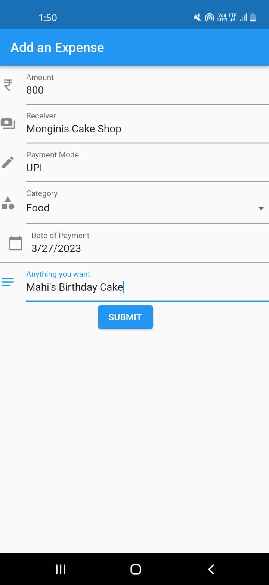
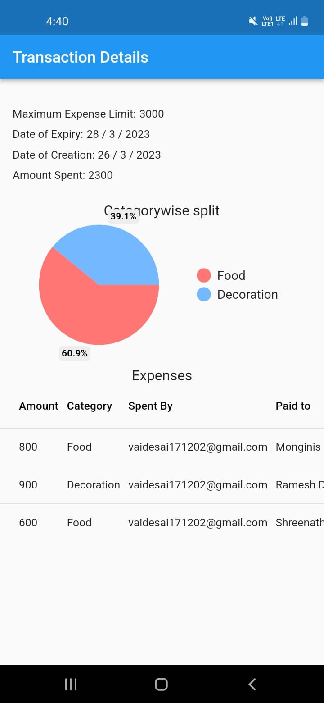
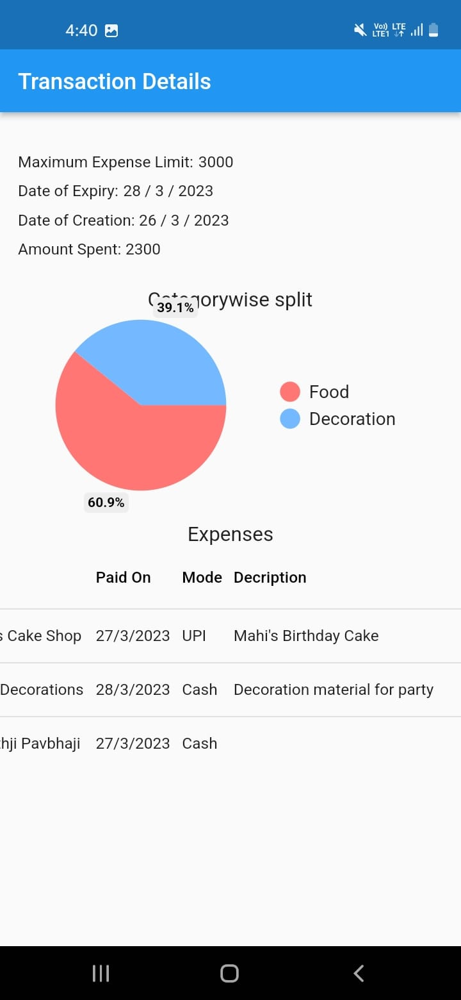
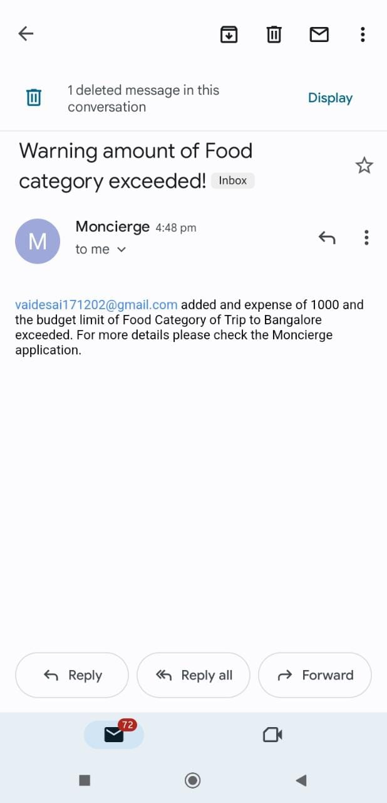

### 🗃️ Some snippets of Database structure
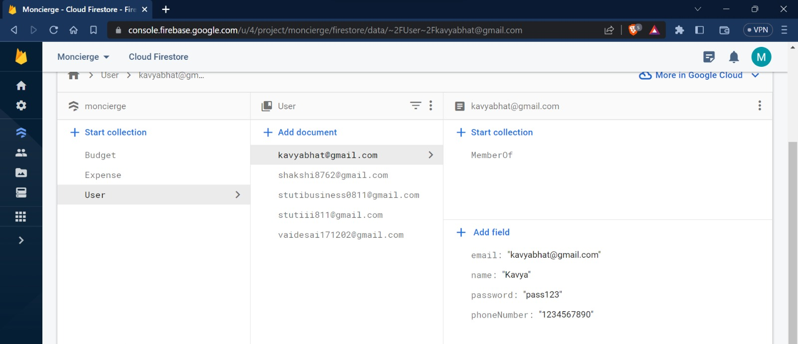
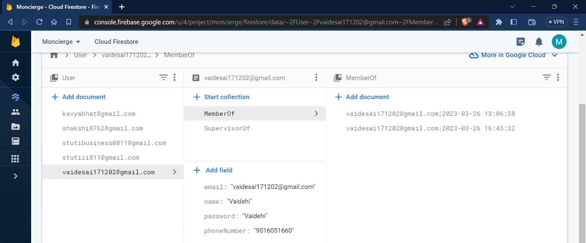
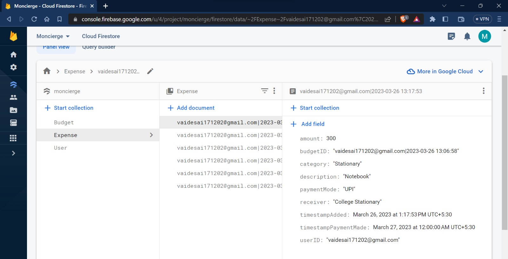
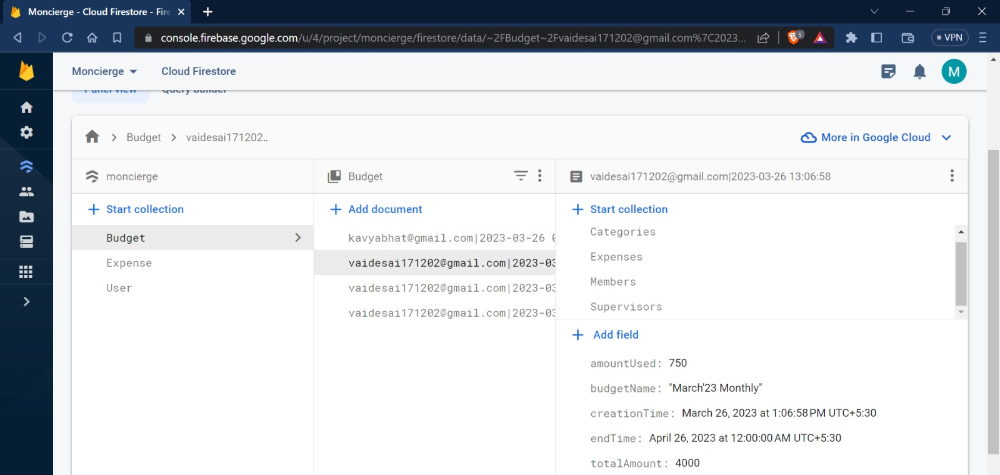

### Unit Test Snippets

### 👩‍🏫 Instructions to Run
* To run the release build of Moncierge application:
    * Find the `app-release.apk` file under `/APK/` folder. 
    * Download the apk file in an Android device and install it.
    * Run the application.
* To run the debug build of Moncierge application:
    * Find the `app-debug.apk` file under `/APK/` folder. 
    * Download the apk file in an Android device and install it.
    * Run the application.

### 🚀 Future Scope

The following features can be added in revisions of this application:
- Assign per User budget in a Group along with per Category budget.
- Recurring Budget: Ask users to recreate or close the budget after it expires.
- Budget Modification: Users can request a Budget update to the Supervisor.
- Periodic Reporting: A weekly, monthly or user specified period for a summarized report of budget violations, savings and category wise spent over the specified time.
- Custom Reports: Users can select a date range and/or choose a category to get a statement of the expenses.
- Add Payment Options and Modes
- Automatic tracking of expense based on Online payments and linking of Bank Account
- Notification via SMS
- Add/invite members to join the group

### 📚 References

- [Flutter Documentation](https://docs.flutter.dev/)
- [Flutter for Beginners](https://www.youtube.com/playlist?list=PL4cUxeGkcC9jLYyp2Aoh6hcWuxFDX6PBJ)
- [Dart Style Guide](https://dart.dev/guides/language/effective-dart/style)
- [Mailer](https://pub.dev/documentation/mailer/latest/)
- [Firebase Authentication](https://firebase.google.com/docs/auth)
- [Cloud Firestore](https://firebase.google.com/docs/firestore)
